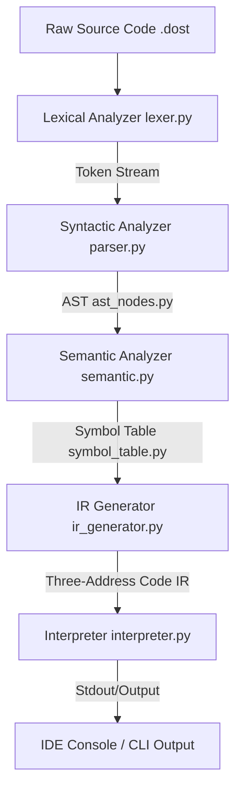

# DostLang Compiler Architecture

This document describes the design and flow of data through the DostLang compiler pipeline.

## Pipeline Walkthrough

### 1. Lexical Analysis (`lexer.py`)
- **Input**: Raw text (UTF-8 string)
- **Output**: A flat stream of Token dictionaries (containing type, value, line number, character index)
- **Engine**: Python Lex-Yacc (PLY) `lex` module.
- **Responsibilities**: Strips comments, increments line counters on newlines, identifies DostLang keywords, converts numeric lexemes into float/int Python types.

### 2. Syntax Analysis (`parser.py`)
- **Input**: Token stream
- **Output**: An Abstract Syntax Tree (AST) rooted at a `ProgramNode`
- **Engine**: PLY `yacc` (LALR(1) parsing)
- **Responsibilities**: Evaluates syntax against grammar rules, resolves operator precedence, builds structured classes for nodes.

### 3. Semantic Analysis & Symbol Table (`semantic.py`, `symbol_table.py`)
- **Input**: AST
- **Output**: Validated AST & scope-populated Symbol Table
- **Responsibilities**:
  - Validates that variables are declared before use.
  - Detects duplicate definitions inside the same scope.
  - Ensures return statements reside only inside function declarations (`kaam`).
  - Verifies function parameter arity during invocation.
  - Infers expression types and checks for type conflicts.

### 4. Intermediate Representation (`ir_generator.py`)
- **Input**: Validated AST
- **Output**: Line-oriented Three-Address Code (TAC) representation
- **Responsibilities**: Flattens nested expressions into sequential instructions using temporary registers (`t1`, `t2`, etc.) and branch labels (`L1`, `L2`, etc.).

### 5. Execution / Interpreter (`interpreter.py`)
- **Input**: AST
- **Output**: Captured program output string & return codes
- **Engine**: Tree-Walking Interpreter
- **Responsibilities**: Executes each node, maintains runtime Environment frame scopes, binds parameter arguments, captures standard output streams, and processes user input.
- **Database Logging**: Execution logs (source, output, token logs, IR, errors, status, timestamp) are stored in an SQLite database via `database.py`.
